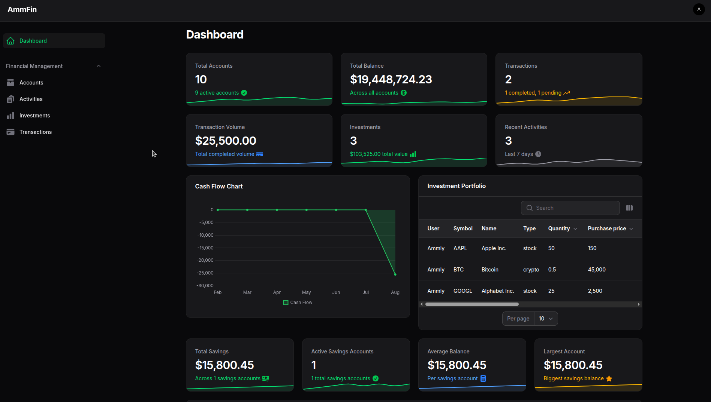

# AmmFin

AmmFin is a personal finance management application built with Laravel and Filament. It provides a comprehensive solution for managing your financial accounts, transactions, investments, and activities.

## Features

- **Account Management**: Track multiple bank accounts, credit cards, and financial accounts
- **Transaction Tracking**: Record and categorize all your financial transactions
- **Investment Portfolio**: Monitor your investments and their performance
- **Activity Logging**: Keep track of all financial activities
- **Multi-Currency Support**: Handle transactions in different currencies
- **Admin Dashboard**: Comprehensive admin panel for system management
- **User Dashboard**: User-friendly interface for personal finance management

## Screenshots



## Built With

- **Laravel 12** - The PHP framework for web artisans
- **Filament 4** - Beautiful admin panels and forms
- **Livewire 3** - Dynamic interfaces without leaving the comfort of Laravel
- **Tailwind CSS 4** - A utility-first CSS framework
- **PostgreSQL** - Advanced open source database
- **Redis** - In-memory data structure store for caching and sessions
- **Laravel Sail** - Docker development environment

## Getting Started

### Prerequisites

- PHP 8.2 or higher
- Composer
- Node.js and npm
- Docker and Docker Compose (for Laravel Sail)

### Installation

1. Clone the repository
```bash
git clone [https://github.com/Ammly/AmmFin.git](https://github.com/Ammly/AmmFin.git) ammfin
cd ammfin
```

2. Install PHP dependencies
```bash
composer install
```

3. Install Node.js dependencies
```bash
./vendor/bin/sail npm install
```

4. Copy the environment file and configure it
```bash
cp .env.example .env
```

5. Generate application key
```bash
./vendor/bin/sail artisan key:generate
```

6. Start the app
```bash
./vendor/bin/sail up -d
```

7. Run database migrations and seeders
```bash
./vendor/bin/sail artisan migrate --seed
```

8. Build assets
```bash
npm run build
```

The application will be available at `http://localhost` with:
- **User Dashboard**: `http://localhost/app`
- **Admin Panel**: `http://localhost/admin`

### Development

To run the development server with hot reloading:
```bash
./vendor/bin/sail up -w
```

## License

AmmFin is open-sourced software licensed under the [MIT license](https://opensource.org/licenses/MIT).
